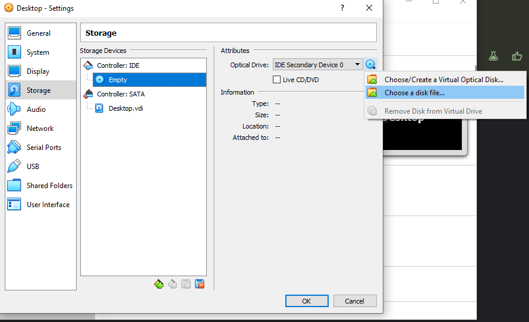
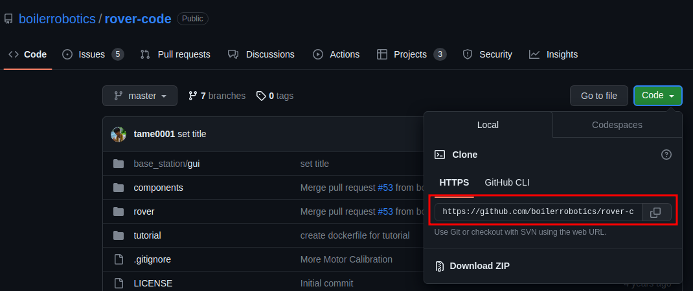
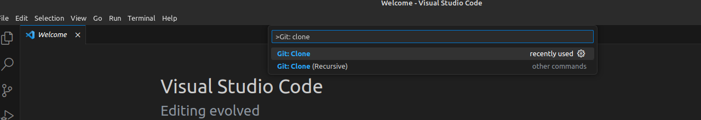
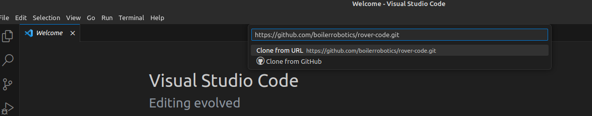
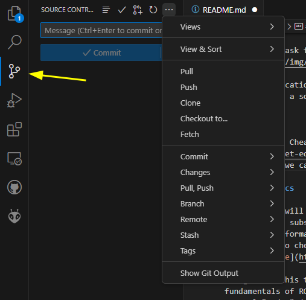

# Tutorial Module

## Install Software

Our core software framework is Robot Operating System or [ROS](https://www.ros.org/).
There are legacy versions of ROS which are no longer actively developed.
The latest version (Noetic Ninjemys) will reach End of Life in May 2025.
Therefore, we will use ROS 2 instead.
The latest ROS 2 release is Iron Irwini (May 2023).
We will use ROS or ROS2 interchangeably, but it will always refer to ROS Iron Irwini.
ROS can run on many operating systems, but we highly recommend using it with Ubuntu.
We also highly recommend creating a virtual machine and installing ROS on it.
Therefore, you will not mess up with your host machine.
The list below is software you need to install.

1. Virtual Machine. We will need to install Ubuntu in the machine.
   The recommendation is [Virtual Box](https://www.virtualbox.org/).

2. [Ubuntu 22.04](https://ubuntu.com/download/desktop) (LTS - Long Term Support). This is a first tier support by ROS.

3. ROS Iron.

### Installation Guide

<ol>
<li> Create a new virtual machine. We recommend to set the machine spec as following

- Type: Linux
- Version: Ubuntu (64-bit)
- Memory: 4096 MB or more (Ff you local machine has less than 8GB of RAM, you may need to use lightweight Ubuntu instead)
- Virtual Hard Drive: 25 GB or more (You will create a Dynamic VirtualBox Disk Image. It will take the actual space the VM use but not more than 25GB or at the capacity you allow it to use)

<li> Mount the Ubuntu ISO that you download by clicking settings -> Storage. Click on CD drive icon then choose the disk file.



<li> Start the machine. You will follow the installation instruction. 
Along the process, you will be an admin of this virtual machine. 
The password that you choose for it is important. 
If you forget the password, there is no way to recover it. 
You will need this password to install software packages later.

<li> Follow this tutorial to install ROS: https://docs.ros.org/en/iron/Installation/Ubuntu-Install-Debians.html

<li> You can choose either (but not both) "desktop" or "base". 
The base version has everything we are using right now. 
The desktop version has tools that could be beneficial, but we don't use it often. 
If you choose to install the base version, keep in mind that you might not be able to run some commands.

<li> At the end, run the following command, it will add a script to activate ROS everytime you open the new terminal.

```bash
echo "source /opt/ros/iron/setup.bash" >> ~/.bashrc
```

<li> Install "colcon". It is a package manager.

```bash
sudo apt install python3-colcon-common-extensions
```

</ol>

### Visual Studio Code and GitHub

We recommend using [Visual Studio Code ](https://code.visualstudio.com/)(VS Code) for writing code.
It comes with extensions that will make coding much easier.
You will need to install [Git](https://git-scm.com/).
For Ubuntu, run the following command to on the terminal

```bash
sudo apt install git
```

Now, you have everything ready to clone the source code and start editing.
You have two options to clone the source code: command or VS Code.
This tutorial will only cover the VS Code option.
First, copy the source code URL from GitHub.


On the VS Code, click View -> Command Palette (Ctrl + Shift + P) then type `git: clone`.


VS Code will ask for the URL.


Select the location that you want to keep the source code. Then you have a source code in your local machine.

## Git 101

Check out Git Cheat Sheet [here](https://education.github.com/git-cheat-sheet-education.pdf).
Fortunately, we can do most of the tasks in VS Code.
In the "Source Control" tab, you will find all Git commands.



Every time before making any commits, make sure that you are working in the correct branch.
By default, you will be in the main (or master) branch.
This branch is protected.
You cannot make any chances to on this branch directly.
You will need to create another branch and submit a pull request after you finish the task.

Making a commit is a two-step process.
First, you will need to stage "changes".
It means you will need to tell Git which files you want to include in this commit.
Next, you will write a commit message then commit.
At this point, the commit is made in your local machine.
You can either push the commit(s) to GitHub.
Note that you can undo your local commits.
But once you push to GitHub, it is irreversible.

## ROS 2 Basics

This section will cover most of what you will need to set up a publisher and subscriber through ROS2. If you ever want additional information on what other things can be done with ROS or want to check some information, their documentation can be found [here](https://docs.ros.org/en/iron/Tutorials.html).

The goal of this tutorial is to familiarize you with the fundamentals of ROS communication. This is primarily done by several "nodes" (essentially single pieces of independent code) sending and receiving messages. For more details on ROS concepts, check this [tutorial](https://docs.ros.org/en/iron/Concepts/Basic.html).

### Creating a ROS 2 workspace

In order to start working with nodes through ROS, you will first need to create the workspace that they will run in. Whenever working with multiple nodes, you will want to start by setting a value called your ROS Domain ID. This essentially sets your ROS up so that nodes will be able to communicate with each other, but it will ignore unrelated nodes on the same network. Each time you open a terminal, you can set this by running the command

```
export ROS_DOMAIN_ID=<your_domain_id>
```

where your_domain_id is any integer between 0 and 101. Once you have your domain id set, make sure that you consistently use the same number for other instances that you want to work together.

A workspace is the directory you have ROS 2 packages in. A package is an organizational unit for your code, which allows it to be run as a node and work with other ROS features. To start, you'll want to make and enter a directory for your workspace.

```
mkdir -p ~/ros2_ws/src
cd ~/ros2_ws/src
```

Feel free to name your workspace folder whatever you would like, but make sure that it still contains the src folder, which is very important to a lot of ROS functionality.

## Writing Publisher and Subscriber Nodes

The simplest form of communication between nodes is a publisher and subscriber setup. One node will write a message to a specific topic (basically just a named place where the value will exist) and another node repeatedly checks that topic to see if anything has been sent. This kind of system is very useful for much of what we need for the rover. For example, one node can constantly publish the state of a joystick and another node can read this in and convert it to motor outputs.

Please go through the [talker and listener tutorial](https://docs.ros.org/en/iron/Tutorials/Beginner-Client-Libraries/Writing-A-Simple-Py-Publisher-And-Subscriber.html) provided in the ROS 2 documentation. This tutorial is very thorough and we strongly recommend that you do the entire process and read it carefully, particularly the section describing how the talker and listener code actually works, as this will be critical to understanding rover communication.

## Communicating Across Machines

Now that you have made a publisher and subscriber, you've successfully gotten communication between 2 nodes running on the same machine. The next step is to do the same process between multiple computers. The goal of this step is to successfully broadcast your name and have it appear on another computer.

In order to do this, you will first want to make a few changes to your publisher code. First of all, alter the message being sent so that it now says your name instead of constantly counting. Then, you will need to set the topic to "name". Your publisher's topic needs to match the topic of the subscriber, so this is what we will be using in this example.

You will also need to change your network settings in VirtualBox. Under Network, you will just need to change from NAT to Bridged Adapter so that you can send and receive messages. Once you have done this and are connected to the same network as the subscriber node, make sure your domain id matches that of the receiving computer.

## Minirover

Now that you can communicate between different machines, it's time to apply that to something more like the rover. This is in the form of the "minirover" which is a small 6 wheel robot with a RaspberryPi. The Pi will be running a node that subscribes to the topic "cmd_vel" and then sets motor speeds based on the information it receives from there. The minirover code can be found [here](https://github.com/boilerrobotics/rover-code/blob/master/rover/src/minirover/minirover/driver.py).

The Minirover takes in a different kind of message than the publisher and subscriber you have worked with so far. Instead of a string, this topic uses something called a Twist. A twist is essentially a special data type with 2 categories: linear and angular. Each of these contain the variables x, y, and z. For the minirover, we only care about the x value from linear and the z value from angular, which control the speeds of the left and right sides of the rover, respectively.

Your task is to write a node that sends a command to control the minirover. You must use Twist message type and send the command to "cmd_vel" topic. Other than that, you have freedom on designing your node.
